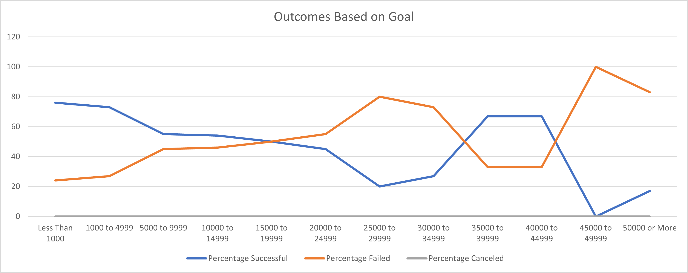
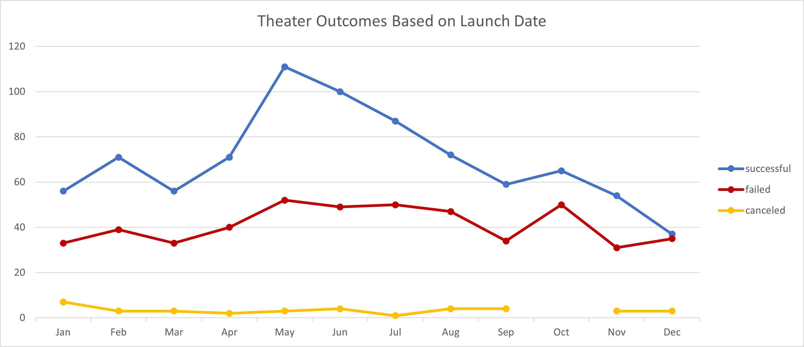

# kickstarter-analysis

## Overview of Project

Provide an analysis of kickstarter data to gain insight for a crowdfunding campaign. The campaign is to help fund a play with a budget over $10,000. 

## Analysis and Challenges
### Analysis

Provide the client a table and chart of outcomes based on the kickstarter goals in the theater category. This should help identify a resonable goal amount for a successful campaign.

Provide the client a table and chart of outcomes based on when the kickstarter was created in the play sub-category. This should help identify an optimal timeframe to create a successful campaign.

### Challenges

This analysis uses data from all countries, and location specific campaigns is not reflected in the analysis. I would suggest to contact the client and ask if the analysis should focus on a specific country. 

## Results

### What are two conclusions you can draw about the Theater Outcomes by Launch Date?

May is the best month to create a Kickstarter for a theater based campaign.

September through March have a higher risk of failure for a theater based campaign. 
	
### What can you conclude about the Outcomes based on Goals?
	
Kickerstarter Goals less than $5000 have the highest success rates for the play sub-category.

### What are some limitations of this dataset?

Past data may not predict future trends. Social, Political, and Economical impacts are not included in the analysis. 

### What are some other possible tables and/or graphs that we could create?

If the play is going to be located in a specific country, we should filter the results based on country.

I would suggest an "Expectations by Luanch Date" table to help set expectations during the campaign. 
* Columns: "backer count", "average pledge", and "average length of campaign"
* Filters: "Parent Category" = theater, "Outcomes", and "goal" between $1000 and $10000, 
* Rows: Months
